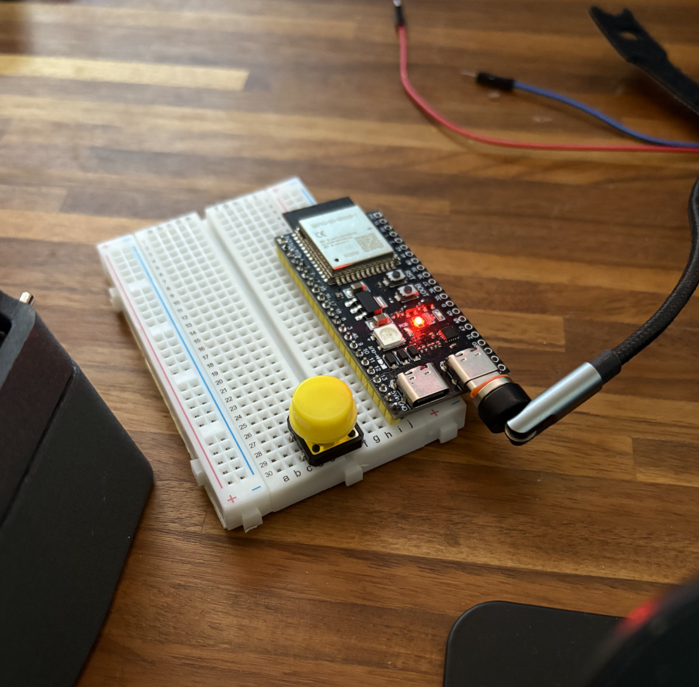
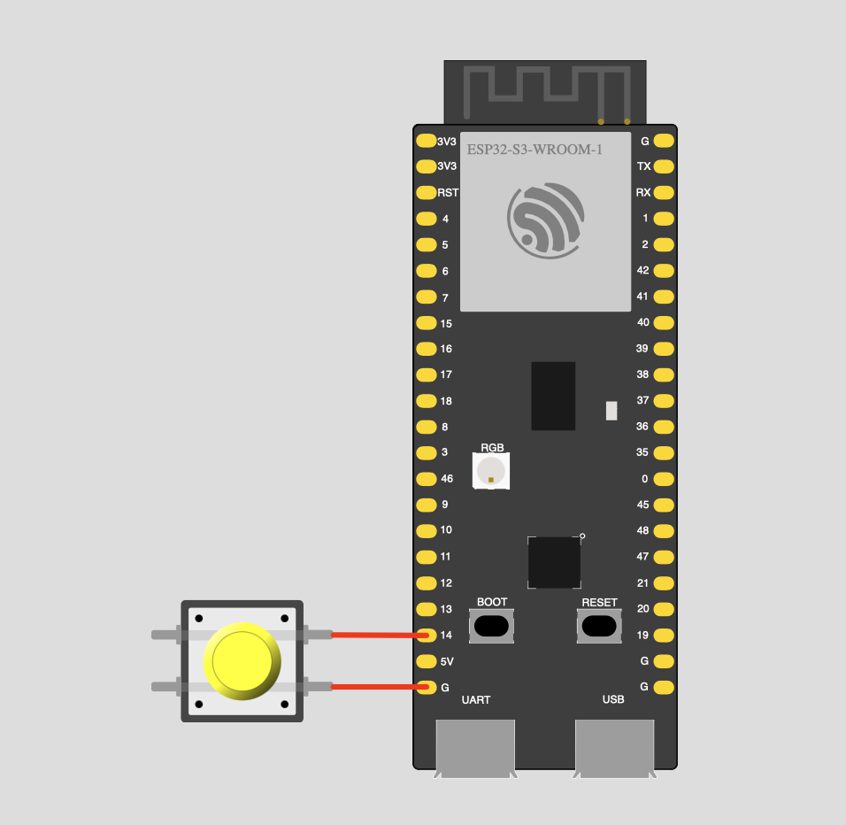

# Toggleable Bluetooth ESP32 S3 Mouse Jiggler

Mouse jiggler, mouse wiggler, mouse mover, many terms for the same thing. 
This connects to your device and simulates activity so you can make a coffee without getting your pay docked. 

## Why I made this

For a mate (seriously — I'm self employed).

## Features

I'm not an expert in Endpoint, but I implemented some detection counter-measures:

- Randomised movement and randomised pauses
- Realistic battery reporting (with simulated charging)
- Named "Logitech M705"

It's not perfect - **the MAC address would reveal that it's an ESP32**. I'm not really sure how to spoof that yet.

## You will need:

- ESP32-S3-WROOM-1 N16R8
- Push button
- Breadboard if lazy
- Soldering iron if you have a headerless board

## Wiring

- Connect a momentary push button between GPIO 14 and GND
- The firmware enables the internal pull‑up (INPUT_PULLUP), so no external resistor is needed
- If you change the pin, update `TOGGLE_BUTTON_PIN` in `src/main.cpp`

## Setup

- Clone the repo
- Open the repo in Visual Studio Code with the PlatformIO extension installed
- If you need a different board, edit `platformio.ini`
- Open the command palette (Cmd+Shift+P on macOS) and run "PlatformIO: New Terminal"
- Plug in the ESP32 (if there are two ports, don't use the OTG port)
- Dependencies are declared in `platformio.ini` under `lib_deps` and will be auto-installed on build
  - Optional: install manually once via `pio pkg install -l "adafruit/Adafruit NeoPixel" && pio pkg install -l "t-vk/ESP32 BLE Mouse"`
- Build and upload: `pio run -t upload`
- Done ✅ In your Bluetooth settings, connect to "Logitech M705"

## Troubleshooting

- Different board? It should still work—just modify `platformio.ini`. If you're stuck, open an issue
- Not sure which port your device is using? In the PlatformIO terminal run `pio devices list` (example: `/dev/cu.wchusbserial58FA0800011`)
- The ESP32 doesn't sit in the breadboard nicely? Blame Espressif 😭 that's why I only have one header soldered on

## License

MIT — see `LICENSE` for details.
